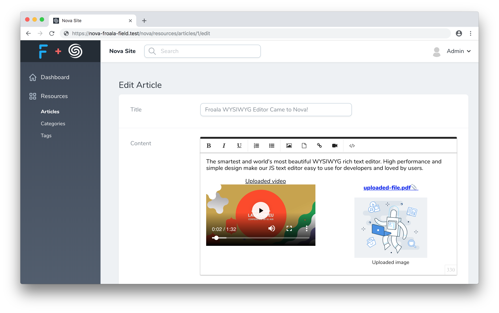
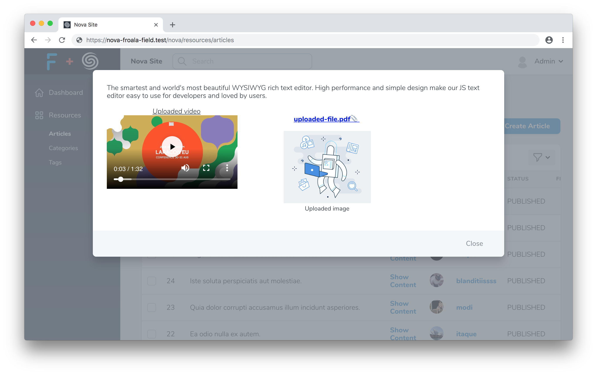

<p align="center"></p>

<p align="center"><strong>Froala WYSIWYG Editor</strong> field for Laravel Nova</p>

<p align="center">
  <a href="https://packagist.org/packages/froala/nova-froala-field"></img></a>
  <a href="https://travis-ci.org/froala/nova-froala-field"></img></a>
  <a href="https://github.styleci.io/repos/151840835"></a>
  <a href="https://packagist.org/packages/froala/nova-froala-field"></a>
</p>

## Introduction

### Froala WYSIWYG Editor Field

Full support of attaching Images, Files and Videos



Notifications for _Froala_ events are handled by [Toasted](https://nova.laravel.com/docs/1.0/customization/frontend.html#notifications) which is provided in _Nova_ by default.

## Upgrading

For upgrading to **Froala 3**, check out – [Upgrading Instructions](UPGRADING.md).

## Installation

You can install the package into a Laravel application that uses [Nova](https://nova.laravel.com) via composer:

```bash
composer require froala/nova-froala-field
```

## Usage

Just use the `Froala\NovaFroalaField\Froala` field in your Nova resource:

```php
namespace App\Nova;

use Froala\NovaFroalaField\Froala;

class Article extends Resource
{
    // ...

    public function fields(Request $request)
    {
        return [
            // ...

            Froala::make('Content'),

            // ...
        ];
    }
}
```

## Override Config Values

To change any of config values for _froala field_, publish a config file:

```bash
php artisan vendor:publish --tag=config --provider=Froala\\NovaFroalaField\\FroalaFieldServiceProvider
```

## Customize Editor Options

For changing any [Available Froala Option](https://www.froala.com/wysiwyg-editor/docs/options)
edit `nova.froala-field.options` value:

```php
/*
|--------------------------------------------------------------------------
| Default Editor Options
|--------------------------------------------------------------------------
|
| Setup default values for any Froala editor option.
|
| To view a list of all available options check out the Froala documentation
| {@link https://www.froala.com/wysiwyg-editor/docs/options}
|
*/

'options' => [
    'toolbarButtons' => [
        [
            'bold',
            'italic',
            'underline',
        ],
        [
            'formatOL',
            'formatUL',
        ],
        [
            'insertImage',
            'insertFile',
            'insertLink',
            'insertVideo',
        ],
        [
            'embedly',
            'html',
        ],
    ],
],

//...
```

If you want to set options only to specific field, just pass them to `options` method:

```php
public function fields(Request $request)
{
    return [
        // ...

        Froala::make('Content')->options([
            'editorClass' => 'custom-class',
            'height' => 300,
        ]),

        // ...
    ];
}
```

## Attachments

**Nova Froala Field** provides native attachments driver which works similar to [Trix File Uploads](https://nova.laravel.com/docs/1.0/resources/fields.html#file-uploads), but with ability to optimize images and preserve file names.
Also you have an ability to switch to the `trix` driver to use its upload system.

* It's Recommended to use `froala` driver (enabled by default) to be able to use current and future
 additional features for attachments, provided by *Froala*.

### Froala Driver

To use `froala` driver, publish and run a migration:

```bash
php artisan vendor:publish --tag=migrations --provider=Froala\\NovaFroalaField\\FroalaFieldServiceProvider 
php artisan migrate
```

### Trix Driver

If previously you have used *Trix* attachments and you want to preserve behavior with same tables and handlers
you can use `trix` driver in config file:

```php
/*
|--------------------------------------------------------------------------
| Editor Attachments Driver
|--------------------------------------------------------------------------
|
| If you have used `Trix` previously and want to save the same flow with
| `Trix` attachments handlers and database tables you can use
| "trix" driver.
|
| *** Note that "trix" driver doesn't support image optimization
| and file names preservation.
|
| It is recommended to use "froala" driver to be able to automatically
| optimize uploaded images and preserve attachments file names.
|
| Supported: "froala", "trix"
|
*/

'attachments_driver' => 'trix'

//...
```

### Attachments Usage

To allow users to upload images, files and videos, just like with _Trix_ field, chain the `withFiles` method onto the field's definition. When calling the `withFiles` method, you should pass the name of the filesystem disk that photos should be stored on:

```php
use Froala\NovaFroalaField\Froala;

Froala::make('Content')->withFiles('public');
```

And also, in your `app/Console/Kernel.php` file, you should register a [daily job](https://laravel.com/docs/5.7/scheduling) to prune any stale attachments from the pending attachments table and storage:

```php
use Froala\NovaFroalaField\Jobs\PruneStaleAttachments;


/**
* Define the application's command schedule.
*
* @param  \Illuminate\Console\Scheduling\Schedule  $schedule
* @return void
*/
protected function schedule(Schedule $schedule)
{
    $schedule->call(function () {
        (new PruneStaleAttachments)();
    })->daily();
}
```

#### Filenames Preservation

A unique ID is generated by default to serve as the file name according to `store` [method specification](https://laravel.com/docs/master/filesystem#file-uploads).
If you want to preserve original client filenames for uploaded attachments, change `preserve_file_names` option in config file to `true`.

```php
/*
|--------------------------------------------------------------------------
| Preserve Attachments File Name
|--------------------------------------------------------------------------
|
| Ability to preserve client original file name for uploaded
| image, file or video.
|
*/

'preserve_file_names' => true,

//...
```

#### Images Optimization

All uploaded images will be optimized by default by [spatie/image-optimizer](https://github.com/spatie/image-optimizer).

You can disable image optimization in config file:

```php
/*
|--------------------------------------------------------------------------
| Automatically Images Optimization
|--------------------------------------------------------------------------
|
| Optimize all uploaded images by default.
|
*/

'optimize_images' => false,

//...
```

Or set custom optimization options for any optimizer:

```php
/*
|--------------------------------------------------------------------------
| Image Optimizers Setup
|--------------------------------------------------------------------------
|
| These are the optimizers that will be used by default.
| You can setup custom parameters for each optimizer.
|
*/

'image_optimizers' => [
    Spatie\ImageOptimizer\Optimizers\Jpegoptim::class => [
        '-m85', // this will store the image with 85% quality. This setting seems to satisfy Google's Pagespeed compression rules
        '--strip-all', // this strips out all text information such as comments and EXIF data
        '--all-progressive', // this will make sure the resulting image is a progressive one
    ],
    Spatie\ImageOptimizer\Optimizers\Pngquant::class => [
        '--force', // required parameter for this package
    ],
    Spatie\ImageOptimizer\Optimizers\Optipng::class => [
        '-i0', // this will result in a non-interlaced, progressive scanned image
        '-o2', // this set the optimization level to two (multiple IDAT compression trials)
        '-quiet', // required parameter for this package
    ],
    Spatie\ImageOptimizer\Optimizers\Svgo::class => [
        '--disable=cleanupIDs', // disabling because it is known to cause troubles
    ],
    Spatie\ImageOptimizer\Optimizers\Gifsicle::class => [
        '-b', // required parameter for this package
        '-O3', // this produces the slowest but best results
    ],
],
```

> Image optimization currently supported only for local filesystems

### Upload Max Filesize

You can set max upload filesize for attachments. If set to `null`, max upload filesize equals to _php.ini_ `upload_max_filesize` directive value.

```php
/*
|--------------------------------------------------------------------------
| Maximum Possible Size for Uploaded Files
|--------------------------------------------------------------------------
|
| Customize max upload filesize for uploaded attachments.
| By default it is set to "null", it means that default value is
| retrieved from `upload_max_size` directive of php.ini file.
|
| Format is the same as for `uploaded_max_size` directive.
| Check out FAQ page, to get more detail description.
| {@link http://php.net/manual/en/faq.using.php#faq.using.shorthandbytes}
|
*/

'upload_max_filesize' => null,

//...
```

## Display Edited Content

According to _Froala_ [Display Edited Content](https://www.froala.com/wysiwyg-editor/docs/overview#frontend) documentation you should publish _Froala_ styles:

```bash
php artisan vendor:publish --tag=froala-styles --provider=Froala\\NovaFroalaField\\FroalaFieldServiceProvider 
```

include into view where an edited content is shown:

```blade
<!-- CSS rules for styling the element inside the editor such as p, h1, h2, etc. -->
<link href="{{ asset('css/vendor/froala_styles.min.css') }}" rel="stylesheet" type="text/css" />
```

Also, you should make sure that you put the edited content inside an element that has the `.fr-view` class:

```html
<div class="fr-view">
    {!! $article->content !!}
</div>
```

## Show on Index Page

You have an ability to show field content on resource index page in popup window:

```php
use Froala/NovaFroalaField/Froala;

Froala::make('Content')->showOnIndex();
```

Just click **Show Content**



## License Key

To setup your license key, uncomment `key` option in the config file and set `FROALA_KEY` environment variable

```php
// ...
'options' => [
    'key' => env('FROALA_KEY'),
    // ...
],
```

## 3rd Party Integrations

To enable a button that uses some a 3rd party service and needs additional script inluding, like: *Embed.ly*, *TUI Advanced Image Editor* or *SCAYT Web SpellChecker*, you should publish 3rd party scripts:

```bash
php artisan vendor:publish --tag=nova-froala-field-plugins --provider=Froala\\NovaFroalaField\\FroalaFieldServiceProvider
```

Script will be dynamically imported when you enable `embedly` or `spellChecker` buttons.

### TUI Advanced Image Editor

If you want to use _TUI Image Editor_ to add advanced image editing options, switch `tuiEnable` option to `true`:

```php
'options' => [
    // 'key' => env('FROALA_KEY'),

    // 'tuiEnable' => true,

    //...
],
```

### Font Awesome 5

If you have a [Font Awesome Pro license](https://fontawesome.com), you can enable using the regular icons instead of
the solid ones by using the iconsTemplate option.

Add `iconsTemplate` config value into `froala-field.php` config:

```php
'options' => [
    // 'key' => env('FROALA_KEY'),

   'iconsTemplate' => 'font_awesome_5',
   // If you want to use the regular/light icons, change the template to the following.
   // iconsTemplate: 'font_awesome_5r'
   // iconsTemplate: 'font_awesome_5l'
   
   //...
],
```

**Note**:

> If you have any problems with loading 3rd party plugins, try to republish it

```bash
php artisan vendor:publish --tag=nova-froala-field-plugins --force
```

## Advanced

### Custom Event Handlers

If you want to setup custom event handlers for froala editor instance, create js file and assign `events` property to `window.froala`:

```javascript
window.froala = {
    events: {
        'image.error': (error, response) => {},
        'imageManager.error': (error, response) => {},
        'file.error': (error, response) => {},
    }
};
```

to all callbacks provided in `window.froala.events`, the context of _VueJS_ form field component is automatically applied, you can work with `this` inside callbacks like with _Vue_ instance component.

After that, load the js file into _Nova_ scripts in `NovaServiceProvider::boot` method:

```php
public function boot()
{
    parent::boot();

    Nova::serving(function (ServingNova $event) {
        Nova::script('froala-event-handlers', public_path('path/to/js/file.js'));
    });
}
```

### Customize Attachment Handlers

You can change any of attachment handlers by passing a `callable`:

```php
use App\Nova\Handlers\{
    StorePendingAttachment,
    DetachAttachment,
    DeleteAttachments,
    DiscardPendingAttachments,
    AttachedImagesList
};

Froala::make('Content')
    ->attach(new StorePendingAttachment)
    ->detach(new DetachAttachment)
    ->delete(new DeleteAttachments)
    ->discard(new DiscardPendingAttachments)
    ->images(new AttachedImagesList)
```

## Testing

``` bash
composer test
```

## Changelog

Please see [CHANGELOG](CHANGELOG.md) for more information on what has changed recently.

## Contributing

Please see [CONTRIBUTING](CONTRIBUTING.md) for details.

## Security

If you discover any security related issues, please email support@froala.com instead of using the issue tracker.

## Credits

- [Slava Razum](https://github.com/slavarazum)
- [All Contributors][link-contributors]

## License

The MIT License (MIT). Please see [License File](LICENSE.md) for more information.

[link-contributors]: ../../contributors
